<p align="center">
  
</p>

# Stride

> Your Strava agentic coach — a local-first, open-source AI running coach.

[](https://github.com/jaypetez/stride/actions/workflows/ci.yml)
[](./LICENSE)
[](.nvmrc)

Stride pulls your Strava workouts, computes real sports-science metrics **in
code**, and uses Claude to explain what happened, suggest your next workout, and
build a training plan — over a shared core exposed through a **CLI**, an **HTTP
API**, a **web UI**, and an **MCP server**.

The guiding split: **numbers are computed by deterministic code; the LLM reasons,
explains, plans, and motivates over those numbers — it never computes them.**

See [`GOAL.md`](GOAL.md) for the full project brief, architecture, and roadmap.

## Status

Early MVP. The sports-science engine, Strava client, coach, and CLI are the core
of the project; the API, web UI, and MCP server build on the same shared core.

## Quickstart

Prerequisites: **Node.js 22+** and **pnpm 10+** (`corepack enable`).

```bash
pnpm install
cp .env.example .env      # add your own Strava + Anthropic credentials

# Try the coach offline on bundled demo data (no credentials needed):
pnpm --filter @stride/cli dev -- analyze --demo

# Connect your own Strava account, then sync and coach:
pnpm --filter @stride/cli dev -- connect
pnpm --filter @stride/cli dev -- sync
pnpm --filter @stride/cli dev -- next
pnpm --filter @stride/cli dev -- plan --race 10k --weeks 8
```

## Workspace

```
apps/
  cli/   commander + @clack/prompts CLI          (@stride/cli)
  api/   Hono HTTP API                            (@stride/api)
  web/   Vite + React dashboard                   (@stride/web)
  mcp/   Model Context Protocol server            (@stride/mcp)
packages/
  core/     sports-science engine + Strava + coach (@stride/core)
  schemas/  Zod schemas — single source of truth   (@stride/schemas)
  config/   shared TypeScript config               (@stride/config)
```

## Scripts

| Command | What it does |
|---|---|
| `pnpm build` | Build all packages and apps (Turborepo) |
| `pnpm typecheck` | Type-check the workspace |
| `pnpm test` | Run unit/integration tests (Vitest) |
| `pnpm lint` | Biome lint + format check |
| `pnpm format` | Auto-fix formatting |

## Contributing

See [CONTRIBUTING.md](CONTRIBUTING.md) and [CODE_OF_CONDUCT.md](CODE_OF_CONDUCT.md).
Security issues: [SECURITY.md](SECURITY.md).

## Disclaimer

Stride is for **informational and educational purposes only** and is **not a
substitute for professional medical advice**. Consult a qualified healthcare
provider before beginning any fitness program.

## Attribution

Stride connects to the Strava API but is **not affiliated with, endorsed by, or
sponsored by Strava, Inc.** Powered by Strava. Data obtained via the Strava API
is subject to the [Strava API Agreement](https://www.strava.com/legal/api).

## License

[Apache-2.0](./LICENSE) © 2026 Jayson Petersen and Stride contributors.
