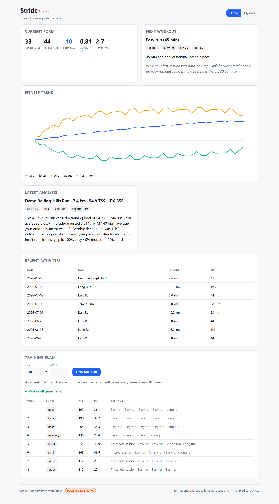

# Stride documentation

Developer and design documentation for Stride, the local-first Strava AI running
coach. For the product intent and roadmap, start with the top-level
[`GOAL.md`](../GOAL.md).

## A guided tour

Stride runs the **entire inner loop offline on bundled demo data** — no Strava
app and no Anthropic key. One shared core (`packages/core`) — the deterministic
sports-science engine, the Strava client, the local store, and the Claude coach —
is exposed through four surfaces: a **CLI**, an **HTTP API**, a **web dashboard**,
and an **MCP server**. The rule everywhere: **numbers are computed in code; the
LLM only explains them.**

Run each command below from the repo root after `pnpm install`. Add `--json` to
`analyze`/`next`/`plan` for machine-readable output, and `--now <ISO>` (or
`STRIDE_NOW`) to pin the clock so demo output is byte-reproducible.

### 1 · Preflight — `stride doctor`

Reports your tooling, which credentials are configured, and exactly what runs
offline versus what needs credentials — the fastest way to confirm your setup.

```bash
pnpm --filter @stride/cli dev doctor
```


### 2 · Analyze a run — `stride analyze --demo`

Computes the sports-science metrics for a completed workout — training load
(TSS), intensity factor, grade-adjusted pace, efficiency factor, aerobic
decoupling, intensity split — then has the coach explain what they mean. The
numbers come from `packages/core`; only the prose is written by the model.

```bash
pnpm --filter @stride/cli dev analyze --demo
```


The full machine-readable payload is captured in [`../examples/analyze.md`](../examples/analyze.md).

### 3 · Get your next workout — `stride next --demo`

Summarizes current form (CTL / ATL / TSB, ACWR, recent volume) and recommends the
next session — with concrete targets and a rationale for *why* this workout, now.

```bash
pnpm --filter @stride/cli dev next --demo
```


Tell the coach how you feel and it is screened for red flags before any advice —
a STOP keyword (e.g. "chest pain") halts coaching and refers you to a
professional:

```bash
pnpm --filter @stride/cli dev next --demo --note "left knee a bit sore"
```

### 4 · Build a training plan — `stride plan --demo`

Generates a periodized block (base → build → peak → taper) with weekly load and
distance targets. Every plan is checked against the guardrails — ramp rate, rest,
no back-to-back-hard days, long-run caps — before you ever see it.

```bash
pnpm --filter @stride/cli dev plan --demo --race 10k --weeks 8
```


### 5 · The web dashboard

The same core, in the browser. The dashboard gets all of its data — demo mode
included — from the HTTP API, so run both (two terminals; demo mode is the
default, so no credentials are needed):

```bash
pnpm --filter @stride/api dev      # http://localhost:8720 — the dashboard's data source
pnpm --filter @stride/web dev      # http://localhost:5173 (the web proxies /api → the API)
```



Use the **Demo / My data** toggle to switch between bundled data and your synced
Strava history; the footer carries the required "Powered by Strava" attribution.
The dashboard follows your system light/dark preference.

### 6 · The HTTP API

The API serves the same facts and coaching over HTTP. Every demo endpoint works
with no credentials:

```bash
pnpm --filter @stride/api dev      # http://localhost:8720

curl localhost:8720/health
curl "localhost:8720/next?demo=true"
curl -X POST localhost:8720/plan -H 'content-type: application/json' \
  -d '{"demo":true,"race":"10k","weeks":8}'
```

`GET /next?demo=true` returns the same workout the CLI prints — abridged here to
the highlights; the full body also carries a `context` block (your current form:
fitness, ACWR, weekly distribution and volume), a top-level `disclaimer`, and a
few more workout fields (`type`, `label`, `description`, `targetDistanceM`, …):

```json
{
  "workout": {
    "title": "Easy run (45 min)",
    "targetDurationSec": 2700,
    "targetPaceSecPerKm": 400,
    "targetHrZone": 2,
    "targetTss": 35,
    "rationale": "Your last session was hard, so keep ~48h between quality days: an easy run aids recovery and preserves the 80/20 balance."
  },
  "flags": []
}
```

Handled errors (bad input, missing resources on known routes) return
`{ error, requestId }` with a matching `x-request-id` header; unknown routes fall
through to Hono's plain-text 404. Other
demo endpoints include `GET /pmc?demo=true`, `GET /activities?demo=true`, and
`GET /analyze/demo`. The web dashboard consumes these through Hono's typed `hc`
RPC client, so request/response types never drift.

### 7 · The MCP server

Stride is also a **Model Context Protocol** server, so an MCP-capable client (e.g.
Claude Desktop) can call the same core over stdio. It exposes **eight tools** —
five read-only *fact* tools (`get_training_load`, `get_recent_activities`,
`get_pace_zones`, `get_next_workout_inputs`, `get_plan_context`) and three *action*
tools (`analyze_workout`, `suggest_next_workout`, `generate_plan`) — each callable
with `{ "demo": true }`.

```bash
pnpm --filter @stride/mcp dev      # speaks MCP over stdio; logs go to stderr
```

The fact tools are thin adapters over the *same* coach toolset the CLI and API
use, so every surface reports byte-identical numbers.

## Contents

- [`architecture.md`](architecture.md) — the three-layer model
  (deterministic compute → Claude reasoning → guardrail/safety), the data flow
  from Strava to the coach, and the four surfaces over one shared core.
- [`adr/`](adr/) — Architecture Decision Records for the non-obvious calls (raw
  `.ts` workspaces, the durable daily-load series, Option A plan generation, the
  advisory sync lock). See the [ADR index](adr/README.md).
- [`../examples/`](../examples/) — real, byte-reproducible output from the
  offline demo commands.

## Related top-level docs

- [`GOAL.md`](../GOAL.md) — the north-star brief.
- [`AGENTS.md`](../AGENTS.md) — machine-readable command manifest, conventions,
  and gotchas.
- [`CONTRIBUTING.md`](../CONTRIBUTING.md) — how to get set up and contribute.
- Per-package READMEs live next to each package (`packages/*/README.md`,
  `apps/*/README.md`).

## Site-ready

These files are plain, self-contained Markdown with relative links, structured
so a documentation site (Astro Starlight or Docusaurus, per GOAL §10 Phase 3)
can be layered on later without rewriting content. Building that site is out of
scope for now.
