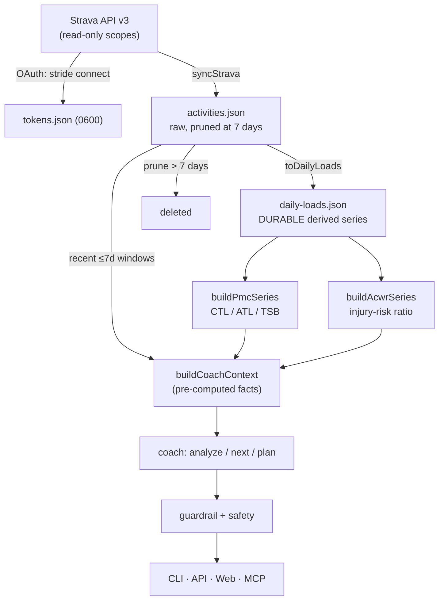

# Architecture

Stride is a **local-first, offline-capable Strava AI running coach**. This
document explains how the pieces fit together. For the full product intent,
compliance research, and roadmap, read [`GOAL.md`](../GOAL.md) — this doc is the
"how it is built" companion to that "what and why".

## The one rule everything follows

> **Numbers are computed by deterministic code; the LLM reasons, explains,
> plans, and motivates over those numbers — it never computes them.**

Every metric Stride reports (training load, CTL/ATL/TSB, ACWR, zones, plan
durations, paces, distances) comes out of the sports-science engine in
`packages/core/src/science`. Claude only writes prose over pre-computed facts.
This is the single most important architectural constraint (GOAL §3) and it is
what eliminates hallucinated metrics.

## Three layers

Stride is organized as three layers, all living in `packages/core` and consumed
by four thin surface adapters.

```
┌────────────────────────────────────────────────────────────────────┐
│  Surfaces (thin adapters):  CLI  │  HTTP API  │  Web UI  │  MCP       │
│                             apps/cli  apps/api  apps/web  apps/mcp    │
├────────────────────────────────────────────────────────────────────┤
│  (3) Guardrail / safety layer                                        │
│      guardrail.ts  validatePlan → repairPlan → re-validate           │
│      safety.ts     detectRedFlags (STOP/warn), PAR-Q, DISCLAIMER     │
├────────────────────────────────────────────────────────────────────┤
│  (2) Claude reasoning layer                                          │
│      coach.ts      analyze / suggest-next / generate-plan            │
│      receives PRE-COMPUTED facts; writes prose; NEVER does math      │
│      degrades to deterministic text when no ANTHROPIC_API_KEY        │
├────────────────────────────────────────────────────────────────────┤
│  (1) Deterministic compute layer  (packages/core)                   │
│      science/  load → PMC → ACWR → zones (every number)             │
│      strava/   OAuth, rate-limit-aware client, mappers               │
│      store/    local-first JSON store + advisory lock                │
│      sync.ts   Strava → local store → durable daily-load series      │
└────────────────────────────────────────────────────────────────────┘
```

### Layer 1 — deterministic compute (`packages/core`)

- **`science/`** — the sports-science engine. Per-activity load (rTSS with
  grade-adjusted NGP, then Banister TRIMP / hrTSS, then a duration-only
  fallback), the Performance Management Chart (`buildPmcSeries`: CTL 42-day
  EWMA, ATL 7-day EWMA, TSB = CTL − ATL), the EWMA-ACWR injury-risk ratio
  (`buildAcwrSeries`), HR/pace zones and VDOT, time-in-zone / 80-20
  distribution, efficiency factor, and aerobic decoupling. Anchors
  (`estimateAnchors`) are derived from history.
- **`strava/`** — a rate-limit-aware Strava client (proactive throttling, HTTP
  429 retry with `Retry-After`, `X-RateLimit-*` header tracking), the local
  loopback OAuth flow, and mappers from Strava's payloads to Stride schemas.
- **`store/`** — a single-user JSON store under `dataDir` (default `.stride/`),
  with atomic writes (temp file + rename), an in-process write mutex, and a
  cross-process advisory sync lock.
- **`sync.ts`** — orchestrates Strava → store → the durable daily-load series
  (see the data flow below).

### Layer 2 — Claude reasoning (`packages/core/src/coach`)

`analyzeWorkout`, `suggestNextWorkout`, and `generatePlan` build a facts bundle
(`buildCoachContext`) from the compute layer and hand it to Claude for prose.
Crucially, **every one of these functions has a deterministic fallback**: with
no `ANTHROPIC_API_KEY`, the coach returns computed, templated text and a
code-built plan skeleton. The LLM is an enrichment, never a dependency — which
is exactly what makes the whole inner loop runnable offline.

Model tiering (`config.ts` `DEFAULT_MODELS`): plan generation uses
`claude-opus-4-8`, conversational analysis `claude-sonnet-5`, and cheap
classification (the optional red-flag second pass) `claude-haiku-4-5`.

### Layer 3 — guardrail / safety

- **Plan guardrail** (`guardrail.ts`): JSON Schema cannot express numeric
  bounds, so a deterministic validator enforces the ramp cap, no back-to-back
  hard days (~48h between quality sessions), a weekly rest minimum, and a
  long-run cap. `generatePlan` runs validate → (if invalid) repair →
  re-validate; an unrepairable proposal is rejected in favor of the always-valid
  skeleton. See [ADR 0003](adr/0003-option-a-plan-generation.md).
- **Safety** (`safety.ts`): deterministic red-flag detection (STOP keywords such
  as chest pain / dizziness halt coaching before any model call; WARN keywords,
  health-screening flags, and load signals add warnings), the PAR-Q readiness
  screening, and the standard medical disclaimer attached to every result.

## Data flow



The load-bearing subtlety is the **derived daily-load series**. Strava's terms
cap the raw cache at 7 days, but a coach needs a fitness history far longer than
a week. So on every sync, Stride recomputes each still-live day's aggregate and
upserts it into a durable `daily-loads.json` **before** the raw activity is
pruned. The durable series carries no raw Strava content — only scalar
aggregates (TSS, duration, distance) — so the PMC/ACWR outlive the 7-day raw
cache while staying compliant. See
[ADR 0002](adr/0002-durable-daily-load-series.md).

At read time the coach context prefers the durable series for the long PMC/ACWR
history and reads the still-fresh raw activities only for the recent (≤7-day)
windows (weekly volume, intensity distribution, "last activity").

## Four surfaces, one core

Each surface is a thin adapter that imports `@stride/core`; **no domain logic is
duplicated into a surface**.

| Surface | Package | Transport | Offline demo |
|---|---|---|---|
| CLI | `apps/cli` | terminal (commander) | `--demo` on `analyze`/`next`/`plan` |
| HTTP API | `apps/api` | HTTP (Hono) | `?demo=true` / `{ "demo": true }` |
| Web UI | `apps/web` | browser (Vite + React) | demo mode by default |
| MCP server | `apps/mcp` | stdio JSON-RPC | `{ "demo": true }` per tool |

The MCP fact tools and the Claude tool runner both call the **same** shared
toolset in `packages/core/src/coach/tools.ts`, so MCP and the coach return
byte-identical facts (GOAL §8).

## Key design & compliance rationale

- **Compute-in-code, reason-in-LLM.** The firewall between numbers and prose is
  enforced structurally: the coach functions accept a facts object and only
  overwrite prose fields with model output. See GOAL §3.
- **7-day raw cache vs durable derived series.** Raw Strava data expires at 7
  days (`pruneExpiredStrava`); the compliance-safe derived aggregate persists.
  [ADR 0002](adr/0002-durable-daily-load-series.md).
- **Owner-only data.** Stride is single-user and local-first: your own Strava
  app credentials, your own Anthropic key, no central server. The HTTP API locks
  CORS to the web UI's origin (`STRIDE_WEB_ORIGIN`) — never `*` — because it
  serves the owner's private data. GOAL §4.
- **Deterministic guardrails over model trust.** A plan the LLM proposes is a
  *proposal*; code is the *enforcer*.
  [ADR 0003](adr/0003-option-a-plan-generation.md).
- **Raw-`.ts` workspace consumption.** `@stride/core` and `@stride/schemas` ship
  as raw TypeScript (no build step) so an agent can edit → run in one hop.
  [ADR 0001](adr/0001-raw-ts-workspace-consumption.md).
- **Reproducible output.** `STRIDE_NOW` (or `--now`) pins the reference clock so
  demo `next`/`plan` output is byte-identical across runs — the diffable-output
  guarantee the verifier depends on.

## Where things live

```
packages/schemas  Zod domain model — single source of truth for types
packages/core     science engine, Strava client, local store, coach, sync, logger
packages/config   shared tsconfig base
apps/cli          commander CLI          apps/api  Hono HTTP API
apps/web          Vite + React dashboard apps/mcp  MCP stdio server
scripts/smoke.mjs the `pnpm verify` runtime smoke harness
```

## Further reading

- [`GOAL.md`](../GOAL.md) — the north-star project brief (vision, compliance,
  sports-science spec, roadmap).
- [`docs/adr/`](adr/) — architecture decision records for the non-obvious calls.
- [`examples/`](../examples/) — real, byte-reproducible offline command output.
- [`AGENTS.md`](../AGENTS.md) — the machine-readable command manifest and gotchas.
